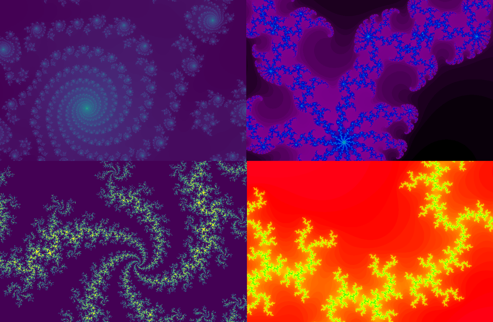
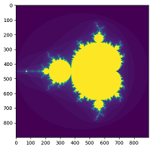
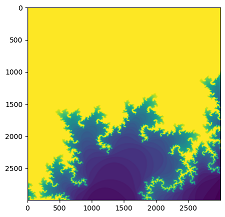
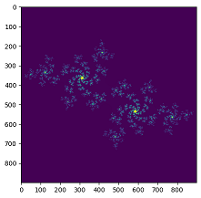

# Fractal Jax
Generate figures of the Julia and Mandelbrot sets with Jax.

`z = z**2 + c`



## Install
This package requires Jax - see the [official Jax documentation](https://github.com/google/jax#installation).
```
pip install --upgrade "jax[cuda]" -f https://storage.googleapis.com/jax-releases/jax_cuda_releases.html
cd fractal-jax
pip install .
```

## Generate Mandelbrot set figures

```python
from fractal_jax import FractalJax

# specify number of iterations, divergence threshold and backend
m = FractalJax(iterations=50, divergence_threshold=2, backend="gpu")
```
```python
import matplotlib.pyplot as plt
fig, ax = plt.subplots(1, 1, figsize=(5, 5))
ax.imshow(
    m.generate_mandelbrot(x_range=[-2, 1], y_range=[-1.5, 1.5], pixel_res=300)
)
```


You can adjust the region which you care about (`x_range` and `y_range`) and the pixel resolution (`pixel_res`):
```python
fig, ax = plt.subplots(1, 1, figsize=(5, 5))
ax.imshow(
    m.generate_mandelbrot(x_range=[-1, -0.9], y_range=[-.3, -.2], pixel_res=30000))
)
```


## Generate Julia set figures
You can generate figures of the Julia set by specifying the complex constant `c`:
```python
fig, ax = plt.subplots(1, 1, figsize=(5, 5))
c=complex(-0.5792518264067199, 0.5448363340450433)
ax.imshow(
    m.generate_julia(c=c, x_range=[-1.5, 1.5], y_range=[-1.5, 1.5], pixel_res=300)
)
```


## Credits
This implementation is based on the analysis made by [jpivarski](https://gist.github.com/jpivarski) in [mandelbrot-on-all-accelerators.ipynb](https://gist.github.com/jpivarski/da343abd8024834ee8c5aaba691aafc7)
